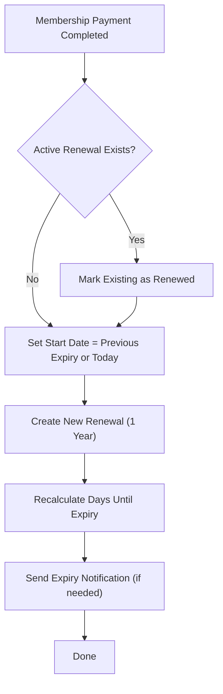
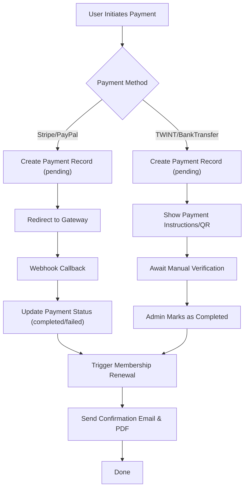

# EN NUR Membership System – Technical & Architecture Overview

## 1. Project Overview

The EN NUR Membership System is a comprehensive, production-grade web application designed to manage memberships, payments, renewals, and administrative operations for the EN NUR organization. Built with Laravel (PHP), it integrates modern payment gateways, PDF generation, robust user management, and advanced error monitoring, providing a secure and scalable platform for both users and administrators.

---

## 2. Technology Stack

- **Backend Framework:** Laravel (PHP 8.1+)
- **Frontend:** Blade templates (server-rendered HTML/CSS), minimal JavaScript
- **Database:** MySQL 8.0+ (or PostgreSQL, supported)
- **PDF Generation:** DomPDF (via barryvdh/laravel-dompdf)
- **Payment Gateways:** Stripe, PayPal, TWINT, Bank Transfer
- **Error Monitoring:** Sentry (sentry/sentry-laravel)
- **Email:** SMTP (configurable)
- **Task Scheduling:** Laravel Scheduler (artisan commands)
- **Containerization:** Docker (optional, for deployment)
- **Hosting:** Render.com (production), local development supported
- **Other Tools:** Composer (PHP dependencies), NPM (JS/CSS assets), Laravel Telescope (debugging)

---

## 3. Directory Structure (Key Folders)

- `app/`
  - `Console/Commands/` – Custom artisan commands (backups, monitoring, setup)
  - `Http/Controllers/` – Application logic, request handling (Admin, Payment, Membership, Auth, etc.)
  - `Http/Middleware/` – Request filtering, security, role enforcement
  - `Models/` – Eloquent ORM models (User, Payment, MembershipRenewal)
  - `Services/` – Business logic (e.g., MembershipService)
  - `Providers/` – Laravel service providers
- `resources/views/` – Blade templates for all web and PDF views
- `routes/` – Route definitions (`web.php`, `auth.php`, `console.php`)
- `config/` – Application and service configuration (app, database, mail, sentry, etc.)
- `database/migrations/` – Database schema migrations
- `database/seeders/` – Data seeders for development/production
- `public/` – Entry point (`index.php`), static assets, images
- `storage/` – Logs, cache, file uploads, backups
- `vendor/` – Composer dependencies

---

## 4. Environment & Deployment

### Local Development
- Clone the repository and install dependencies (`composer install`, `npm install`)
- Copy `.env.example` to `.env` and configure local settings
- Generate app key: `php artisan key:generate`
- Run migrations and seeders: `php artisan migrate --seed`
- Start the server: `php artisan serve`

### Production Deployment (Render.com)
- Set environment variables in Render dashboard (see below)
- Deploy latest code (auto or manual)
- Run production commands:
  - `composer install --no-dev --optimize-autoloader`
  - `php artisan migrate --force`
  - `php artisan config:cache && php artisan route:cache && php artisan view:cache`
- Configure payment gateways, mail, and Sentry DSN in Render environment

### Key Environment Variables
- `APP_ENV`, `APP_DEBUG`, `APP_URL`
- `DB_CONNECTION`, `DB_HOST`, `DB_DATABASE`, `DB_USERNAME`, `DB_PASSWORD`
- `STRIPE_KEY`, `STRIPE_SECRET`, `PAYPAL_CLIENT_ID`, `PAYPAL_CLIENT_SECRET`, `TWINT_MERCHANT_ID`, etc.
- `MAIL_MAILER`, `MAIL_HOST`, `MAIL_USERNAME`, `MAIL_PASSWORD`, `MAIL_FROM_ADDRESS`
- `SENTRY_LARAVEL_DSN` (for error monitoring)

---

## 5. Database Schema (Main Tables)

### Users
- Stores all user accounts (members, admins, super admins)
- Fields: id, name, email, password, role, status, contact info, terms acceptance, etc.

### Payments
- Tracks all payment transactions (membership, donations, etc.)
- Fields: id, user_id, amount (in cents), payment_type, status, method, created_at, etc.

### Membership Renewals
- Records membership renewal history and status
- Fields: id, user_id, payment_id, membership_start_date, membership_end_date, is_expired, is_renewed, etc.

### Other Tables
- `sessions` (user sessions), `jobs` (queue), `cache`, `telescope_entries` (debugging), etc.

**Relationships:**
- User has many Payments, MembershipRenewals
- Payment belongs to User
- MembershipRenewal belongs to User and Payment

---

## 6. Core Services & Integrations

### Payment Gateways
- **Stripe:** Credit/debit card payments, webhooks for real-time status
- **PayPal:** PayPal account payments, sandbox/live support
- **TWINT:** Swiss mobile payments, QR code support
- **Bank Transfer:** Manual confirmation, reference tracking

### PDF Generation
- All receipts, invoices, and payment exports are generated as PDFs using DomPDF
- Custom Blade templates for professional, branded documents

### Error Monitoring
- **Sentry:** Captures all unhandled exceptions and errors in both local and production
- DSN configured via environment variable
- Integration registered in `bootstrap/app.php`

### Email
- SMTP configuration for notifications, password resets, payment confirmations
- Configurable via `.env`

### Backups & Monitoring
- Automated database backups via artisan commands and scheduler
- Log management and rotation
- Laravel Telescope for debugging (optional, not enabled in production)

---

## 7. Application Architecture

### MVC Pattern
- **Controllers:** Handle HTTP requests, business logic, and responses
- **Models:** Eloquent ORM for database interaction and relationships
- **Views:** Blade templates for web pages and PDFs

### Middleware
- Role-based access control (Admin, Super Admin, User)
- Terms acceptance enforcement
- CSRF protection
- HTTPS enforcement in production

### Scheduled Tasks & Commands
- Custom artisan commands for backups, monitoring, setup, and log cleanup
- Scheduled via Laravel’s scheduler in `bootstrap/app.php`

### Exception Handling
- Centralized via Laravel’s exception handler
- Sentry integration for error reporting

---

## 8. Security

- CSRF protection on all forms
- SQL injection prevention via Eloquent ORM
- XSS protection via Blade escaping
- Secure password hashing (bcrypt)
- Role-based access control and permissions
- Input validation and sanitization (Form Requests)
- HTTPS enforcement in production
- Rate limiting on sensitive endpoints
- Secure file uploads
- Environment variables for all secrets/keys

---

## 9. Testing & Development

- **Unit and Feature Tests:** Run with `php artisan test`
- **Code Style:** Enforced with Laravel Pint (`./vendor/bin/pint`)
- **Database Seeding:**
  - `php artisan db:seed` (development)
  - `php artisan db:seed --class=ProductionSeeder` (production)
- **Debugging:** Laravel Telescope (for local/dev), Sentry for error monitoring

---

## 10. Maintenance & Monitoring

- **Backups:** Automated via scheduled artisan commands
- **Log Management:** Laravel log rotation, error monitoring via Sentry
- **Updates:**
  - Regular Laravel and dependency updates
  - Security patches
  - Payment gateway updates
- **Monitoring:**
  - Sentry for errors
  - Telescope for local debugging
  - Admin dashboard for system health

---

## 11. Onboarding New Developers

- Clone the repository and follow the setup instructions in this document
- Review the `README.md` for feature and usage details
- Use this technical overview for architecture and environment understanding
- For questions, contact the project maintainer or refer to the `/docs` folder if available

---

## 12. Detailed Business Logic & Code References

### 12.1 Membership Renewals
- **Where:**
  - `app/Http/Controllers/PaymentController.php` (methods: handleSuccessfulPayment, createMembershipRenewal)
  - `app/Models/MembershipRenewal.php` (model logic)
  - `app/Console/Commands/CheckMembershipRenewals.php` (scheduled command)
  - `app/Services/MembershipService.php` (status calculation)
- **How it works:**
  - When a membership payment is completed, `handleSuccessfulPayment()` in `PaymentController` calls `createMembershipRenewal()`.
  - If the user has an active renewal, it is marked as renewed and a new renewal is created starting from the previous expiry (or today if expired).
  - Renewals are always for 1 year.
  - Days until expiry are recalculated regularly (via `CheckMembershipRenewals` command and model methods).
  - Notifications are sent as expiry approaches (see `MembershipRenewalController`, `markNotificationSent`, `getNotificationMessage`).
  - Renewals are marked as expired if days until expiry <= 0.

#### Mermaid Diagram: Membership Renewal Flow

### 12.2 Payment Processing
- **Where:**
  - `app/Http/Controllers/PaymentController.php` (Stripe, PayPal, TWINT, Bank Transfer logic)
  - `app/Models/Payment.php` (model, status constants, relationships)
- **How it works:**
  - Each payment method has its own validation and record creation logic (see methods for Stripe, PayPal, TWINT, Bank Transfer).
  - Amounts are stored in cents (e.g., CHF 400 = 40000).
  - Statuses: `pending`, `completed`, `failed`, `cancelled`.
  - Stripe/PayPal use webhooks to confirm payment and update status.
  - Bank transfers are marked as `pending` until manually verified by an admin.
  - On successful payment, triggers membership renewal and sends confirmation email with PDF receipt.

#### Mermaid Diagram: Payment Processing Flow

### 12.3 User Management & Roles
- **Where:**
  - `app/Models/User.php` (role logic, terms acceptance, relationships)
  - `app/Http/Controllers/AdminController.php` (user CRUD, password reset, role assignment)
- **How it works:**
  - Roles: `user`, `admin`, `super_admin` (see `User::getRoles()`)
  - Terms acceptance tracked via `terms_accepted_at` and related fields.
  - Passwords are hashed using Laravel’s built-in hashing.
  - Admins can create users with or without email verification (direct password setup).
  - Users can update their profile and change their password.

### 12.4 Scheduled Tasks & Artisan Commands
- **Where:** `app/Console/Commands/`
- **Key Commands:**
  - `membership:check-renewals` – Updates expiry, creates missing renewals, marks renewals as renewed.
  - `create:expired-test-users` – Sets up test users with expired/expiring memberships.
  - `log:clear`, `db:backup`, etc. – Maintenance and backup tasks.
- **How it works:**
  - Scheduled via Laravel’s scheduler in `bootstrap/app.php`.
  - Run automatically (e.g., daily, weekly) or manually via `php artisan`.

### 12.5 Notifications & Emails
- **Where:**
  - `app/Http/Controllers/MembershipRenewalController.php` (sendNotification)
  - `app/Http/Controllers/AdminController.php` (bulk notifications, payment confirmations)
- **How it works:**
  - Renewal reminders sent as expiry approaches (customizable intervals).
  - Payment confirmation emails sent after successful payment.
  - Admins can send bulk notifications to users.
  - All emails use SMTP settings from `.env`.

### 12.6 PDF Generation
- **Where:**
  - `app/Http/Controllers/PaymentController.php` (generateReceipt)
  - Blade templates in `resources/views/admin/` (e.g., `payment-receipt.blade.php`)
- **How it works:**
  - On payment completion, a PDF receipt is generated using DomPDF and sent via email.
  - Admins and users can export receipts and reports from the dashboard.

### 12.7 Extending the System
- **Adding a New Payment Method:**
  - Add logic to `PaymentController` for the new method.
  - Update payment forms and validation.
  - Add new status/metadata as needed in `Payment` model.
- **Adding New Notifications:**
  - Add email logic in relevant controller/service.
  - Update notification templates.
- **Customizing Membership Logic:**
  - Adjust renewal logic in `PaymentController` and `MembershipRenewal` model.
  - Update scheduled commands if needed.

---

**For further details, see the referenced files and methods. Review the codebase for implementation specifics and consult Laravel’s documentation for framework features.** 